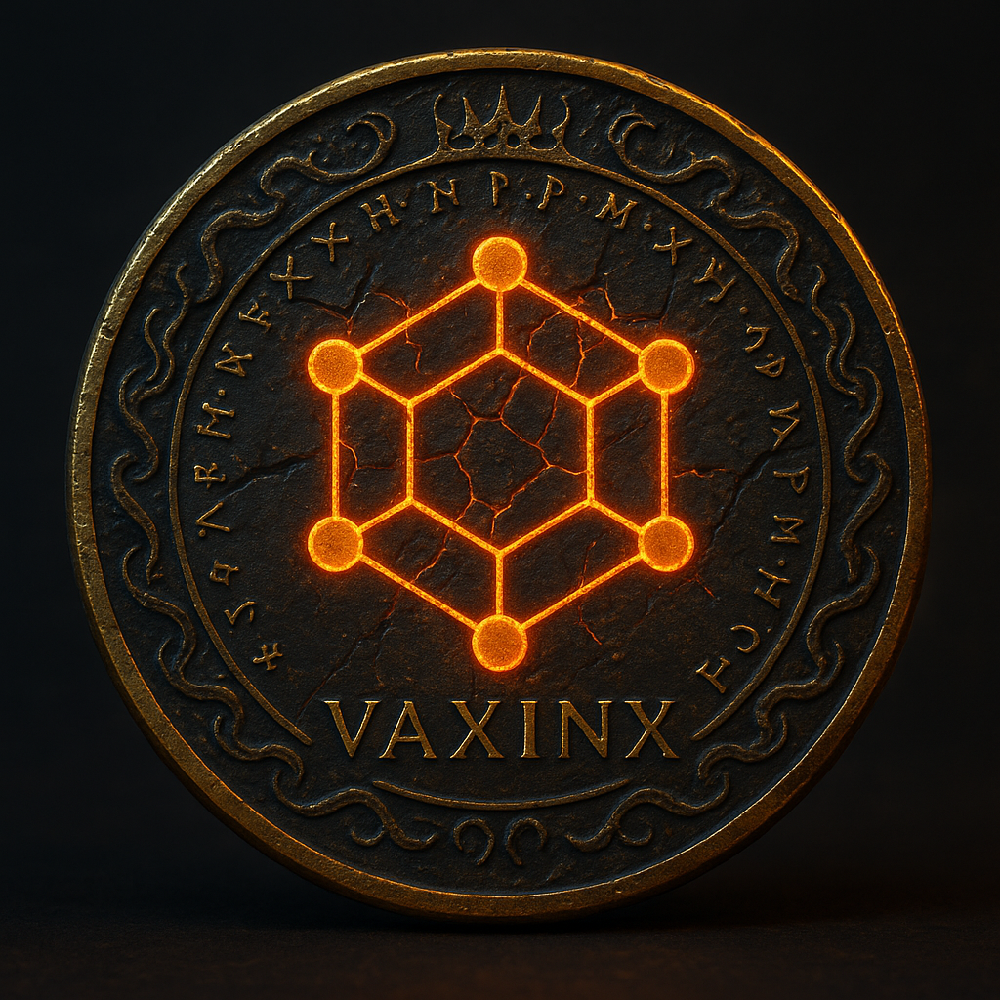

<div align="center">



```
██╗   ██╗ █████╗ ██╗  ██╗██╗███╗   ██╗██╗  ██╗
██║   ██║██╔══██╗╚██╗██╔╝██║████╗  ██║╚██╗██╔╝
██║   ██║███████║ ╚███╔╝ ██║██╔██╗ ██║ ╚███╔╝ 
╚██╗ ██╔╝██╔══██║ ██╔██╗ ██║██║╚██╗██║ ██╔██╗ 
 ╚████╔╝ ██║  ██║██╔╝ ██╗██║██║ ╚████║██╔╝ ██╗
  ╚═══╝  ╚═╝  ╚═╝╚═╝  ╚═╝╚═╝╚═╝  ╚═══╝╚═╝  ╚═╝
```

**VAXINX Protocol™** — Cybersecurity Portfolio & Defensive System

[](https://www.credly.com/users/regis-lara)
[](https://www.credly.com/users/regis-lara)
[](https://github.com/regis-lara)
[](#)

> `think_like_attacker → act_like_defender`

</div>

---

## 🗂️ What This Is

A **live GitHub Pages portfolio** that proves, maps, and applies cybersecurity knowledge in real time.

Not just certificates. Not just code. Both — connected.

| Layer | What's Here |
|---|---|
| 📜 **Credentials** | Verified Cisco / Credly certifications |
| 🧠 **Skill Map** | Concepts translated into deployable logic |
| 🛠️ **Live Builds** | Python tools actively built from this knowledge |

🌐 **Live site:** `Settings → Pages → Deploy from branch → main → /root`

---

## 🏆 Certifications

### Cisco Networking Academy — Introduction to Cybersecurity

```
Holder  : Regis Lara
Issued  : May 01, 2026
Status  : ✅ Verified
```

**Latest achievements unlocked:**

| Type | Name | Course |
|---|---|---|
| 🎖️ Course Badge | Introduction to Cybersecurity | Intro to Cybersecurity |
| 📜 Certificate | Introduction to Cybersecurity | Intro to Cybersecurity |
| 🧠 Achievement | Resource Specialist | Intro to Cybersecurity |
| 🛡️ Achievement | Network Defense | Intro to Cybersecurity |
| 🔐 Achievement | System Safeguards | Intro to Cybersecurity |

🔗 [`credly.com/users/regis-lara`](https://www.credly.com/users/regis-lara)

---

## 🛠️ Active Builds (VAXINX System)

Certifications applied — not just collected.

```
vaxinx-cert-dashboard/
├── index.html                          ← Live portfolio dashboard
└── assets/
    ├── vaxinxseal.png                  ← VAXINX brand seal
    ├── introduction-to-cybersecurity.png
    └── certificate.pdf
```

**In-progress modules:**

```python
VAXINX_SYSTEM = {
    "file_scanner"      : "Python-based threat detection",
    "stoplight_logic"   : "RED / YELLOW / GREEN risk classification",
    "siem_lite"         : "Log ingestion + pattern analysis (planned)",
    "dlp_module"        : "Data loss prevention checks (planned)",
    "json_reports"      : "Structured output for audit trails",
    "html_dashboard"    : "Visual risk summary interface",
}
```

---

## 🧠 Skill Extraction

```python
resource_specialist = knowledge_base
network_defense     = detect + block + monitor
system_safeguards   = protect + control + policy
```

---

## ⚡ One-Liner Locks

Core concepts compressed into deployable logic:

```bash
IDS      = detect
IPS      = block
SIEM     = analyze_logs
DLP      = protect_data
risk     = probability * impact
security = prevent → detect → respond → recover
```

---

## 🔥 Mindset

```
learning + proof + build = unstoppable_growth
```

---

## 👤 Author

**Regis Lara** — VAXINX Protocol™  
Cybersecurity + Python Builder

[](https://www.credly.com/users/regis-lara)
