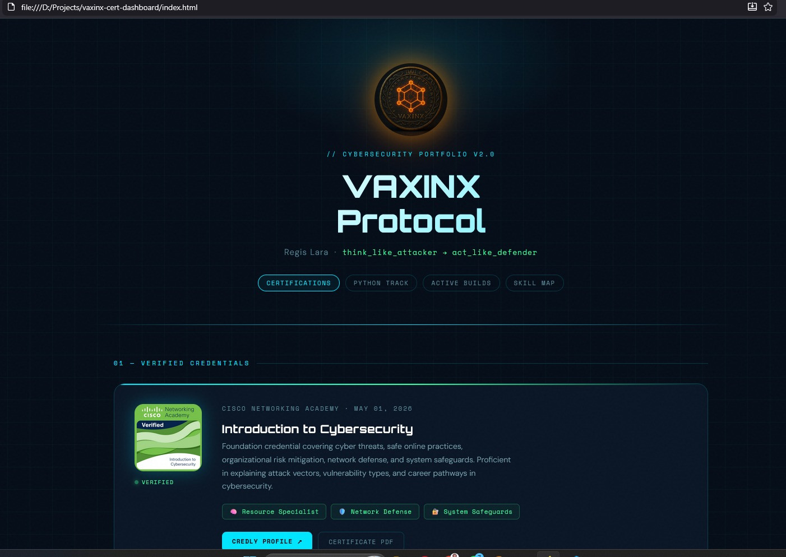

<div align="center">


**VAXINX Protocol™** — Cybersecurity Portfolio & Certification Knowledge System

[](https://www.credly.com/users/regis-lara)
[](https://www.credly.com/users/regis-lara)
[](https://www.nvidia.com/en-us/training/)
[](https://github.com/regis-lara)
[Status](https://img.shields.io/badge/Status-Actively_Building-39ff9a?style=flat-square)

<p align="center">
  <strong>
    <span style="background:#0f172a;color:#94a3b8;padding:6px 12px;">THINK LIKE ATTACKER</span>
    <span style="background:#06b6d4;color:#001018;padding:6px 12px;">→ ACT LIKE DEFENDER</span>
  </strong>
</p>

</div>

---

## 🌐 Live Preview

👉 [Open VAXINX Dashboard](https://regislara-byte.github.io/vaxinx-cert-dashboard/)

---

## 👁️ Dashboard Preview

[](https://regislara-byte.github.io/vaxinx-cert-dashboard/)

---

## 🗂️ What This Is

A **live GitHub Pages Certification Knowledge System** that proves, maps, and applies knowledge in real time.

Not just certificates. Not just code. Both — connected.

| Layer | What's Here |
|---|---|
| 📜 **Credentials** | Verified Cisco / Anthropic / NVIDIA certifications |
| 🧠 **Skill Matrix** | Concepts organized into deployable skill categories |
| 📅 **Learning Timeline** | Chronological progression from first cert to planned future tracks |
| 🛠️ **Live Builds** | Python tools actively built from this knowledge |
| 🔄 **VLA System** | Versioned Learning Archive for every milestone |

🌐 **Live site:** `Settings → Pages → Deploy from branch → main → /root`

---

## 📊 Certification Statistics

| Metric | Value |
|---|---|
| Total Certifications | 5 |
| Providers | 3 (Cisco, Anthropic, NVIDIA) |
| NVIDIA Quiz Score | 100% |
| Skills Unlocked | 16+ |
| Tracks In Progress | 2 |

---

## 🏆 Certifications

### Cisco Networking Academy — Introduction to Cybersecurity

```
Holder  : Regis Lara
Issued  : May 01, 2026
Status  : ✅ Verified
```

**Achievements unlocked:**

| Type | Name | Course |
|---|---|---|
| 🎖️ Course Badge | Introduction to Cybersecurity | Intro to Cybersecurity |
| 📜 Certificate | Introduction to Cybersecurity | Intro to Cybersecurity |
| 🧠 Achievement | Resource Specialist | Intro to Cybersecurity |
| 🛡️ Achievement | Network Defense | Intro to Cybersecurity |
| 🔐 Achievement | System Safeguards | Intro to Cybersecurity |
| 🎯 Achievement | Threat Analysis | Intro to Cybersecurity |
| ⚙️ Achievement | Cybersecurity Administration | Intro to Cybersecurity |

🔗 [`credly.com/users/regis-lara`](https://www.credly.com/users/regis-lara)

---

### Anthropic Education — AI Fluency Series

```
Holder  : Regis Lara
Issued  : 2026
Status  : ✅ Verified
Courses : 3
```

**Courses completed:**

| Type | Name |
|---|---|
| 📜 Certificate | AI Fluency Framework & Foundations |
| 📜 Certificate | AI Capabilities & Limitations |
| 📜 Certificate | Claude 101 |

**Skills covered:** Delegation · Description · Discernment · Diligence · Prompt Engineering · Responsible AI · Human + AI Collaboration

---

### NVIDIA Academy — AI for All: From Basics to GenAI Practice

```
Holder  : Regis Lara
Issued  : June 07, 2026
Score   : 100% (Completion Quiz)
Status  : ✅ Verified
```

**Achievements unlocked:**

| Type | Name | Course |
|---|---|---|
| 📜 Certificate | AI for All: From Basics to GenAI Practice | NVIDIA Academy |
| ⚡ Achievement | GenAI Practitioner | NVIDIA Academy |

**Skills covered:** Generative AI · Foundation Models · LLMs · GPU Acceleration · AI Factories · Agentic AI · Physical AI

---

## 📅 Learning Timeline

```
May 2026    Cisco — Introduction to Cybersecurity          ✅ Completed
2026        Anthropic — AI Fluency Framework & Foundations ✅ Completed
2026        Anthropic — AI Capabilities & Limitations      ✅ Completed
2026        Anthropic — Claude 101                         ✅ Completed
Jun 2026    NVIDIA — AI for All: GenAI Practice (100%)     ✅ Completed
──────────────────────────────────────────────────────────────────────
Upcoming    Cisco — Python Essentials 1                    🟡 In Progress
Planned     Harvard / edX — CS50                           ⏳ Planned
```

---

## 🧠 Skill Matrix

### AI Fluency
- Delegation · Description · Discernment · Diligence · Human + AI Collaboration

### Generative AI
- Foundation Models · LLMs · Prompt Engineering · Responsible AI

### AI Infrastructure
- GPU Computing · AI Factories · Agentic AI · Physical AI · Digital Twins

### Cybersecurity
- Network Defense · System Safeguards · Threat Analysis · IDS / IPS / SIEM · DLP · Risk Management

### Engineering
- GitHub Pages · Documentation Systems · Knowledge Compression · Portfolio Systems

---

## 🔗 Skill → Project Map

```
Certificates
    ↓
Skill Extraction
    ↓
Documentation (VLA)
    ↓
Active Builds (Python / Dashboard)
    ↓
GitHub Pages
    ↓
Public Evidence
```

---

## 🛠️ Active Builds (VAXINX System)

Certifications applied — not just collected.

```
vaxinx-cert-dashboard/
├── index.html                              ← Live portfolio dashboard
├── README.md                               ← This file
├── VLA.md                                  ← Versioned Learning Archive
├── VLA_INDEX.md                            ← VLA index
├── VLA_CHANGELOG.md                        ← Change log
└── assets/
    ├── vaxinxseal.png                      ← VAXINX brand seal
    ├── introduction-to-cybersecurity.png   ← Cisco badge
    ├── nvidia-ai-for-all-preview.png       ← NVIDIA preview image
    ├── achievements.jpeg
    ├── certificate.pdf                     ← Cisco certificate
    ├── nvidia-ai-for-all-certificate.pdf   ← NVIDIA certificate
    ├── badge_NVIDIA.pdf
    ├── AI_Fluency_Foundation_Framework.pdf
    ├── AI_Fluency_AI_Capabilities_Limitations.pdf
    ├── Claude101.pdf
    └── preview.jpeg
```

## 📊 Learning Progress

| Track | Status |
|------|--------|
| Cisco Intro to Cybersecurity | ✅ Completed |
| Anthropic AI Fluency Framework & Foundations | ✅ Completed |
| Anthropic AI Capabilities & Limitations | ✅ Completed |
| Anthropic Claude 101 | ✅ Completed |
| NVIDIA AI for All: From Basics to GenAI Practice | ✅ Completed (100%) |
| Python Essentials 1 | 🟡 In Progress |
| CS50 Introduction to Computer Science | ⏳ Planned |

**In-progress modules:**

```python
VAXINX_SYSTEM = {
    "file_scanner"      : "Python-based threat detection",
    "stoplight_logic"   : "RED / YELLOW / GREEN risk classification",
    "siem_lite"         : "Log ingestion + pattern analysis (planned)",
    "dlp_module"        : "Data loss prevention checks (planned)",
    "json_reports"      : "Structured output for audit trails",
    "html_dashboard"    : "Visual risk summary interface",
}
```

---

## 🧠 Skill Extraction

```python
resource_specialist = knowledge_base
network_defense     = detect + block + monitor
system_safeguards   = protect + control + policy
ai_fluency          = delegate + describe + discern + execute
genai_practice      = foundation_models + LLMs + prompt_engineering
```

---

## ⚡ One-Liner Locks

Core concepts compressed into deployable logic:

```bash
IDS      = detect
IPS      = block
SIEM     = analyze_logs
DLP      = protect_data
risk     = probability * impact
security = prevent → detect → respond → recover
AI_human = AI_accelerates + human_validates
```

---

## 🔄 VAXINX Reverse Learning Method

<p align="center">
  <strong>
    <span style="background:#0f172a;color:#94a3b8;padding:6px 12px;">THINK LIKE ATTACKER</span>
    <span style="background:#06b6d4;color:#001018;padding:6px 12px;">→ ACT LIKE DEFENDER</span>
  </strong>
</p>

A practical approach where systems are built first, then mapped back to theory for deeper understanding.

### 🧠 Workflow

```txt
BUILD → TEST → BREAK → UNDERSTAND → IMPROVE → DEPLOY
```

---

## 👤 Author

**Regis Lara** — VAXINX Protocol™  
Cybersecurity + AI + Python Builder

[](https://www.credly.com/users/regis-lara)
